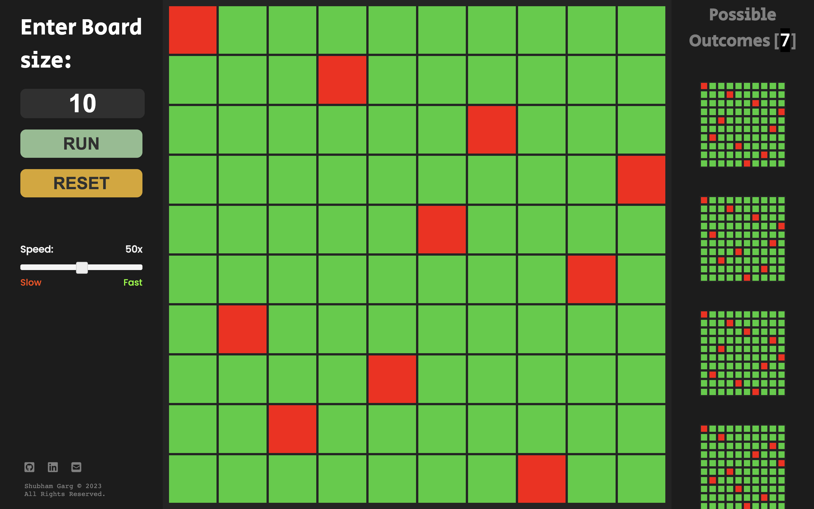

  <h3 align="center">Alvis, N-Queens</h3>

  

    Visualize Popular N-Queens DSA Problem 
     
    (Desktop only version) 
     
    <a href="https://github.com/shubhamistic/shubhamistic.github.io/tree/main/alvis/n-queens"><strong>Explore the docs »</strong></a>
     
    ·
    <a href="https://github.com/shubhamistic/shubhamistic.github.io/issues">Report Bug</a>
    ·
    <a href="https://github.com/shubhamistic/shubhamistic.github.io/issues">Request Feature</a>
    ·
  

## Visit

### [shubhamistic.com/alvis/n-queens](https://shubhamistic.com/alvis/n-queens/)

## Demo

## Tech Stack
- HTML
- CSS
- JAVASCRIPT
- J-QUERY

## Author
[@shubhamistic](https://www.github.com/shubhamistic)

## Feedback
If you have any feedback, please reach out to us at [shubham2003garg@gmail.com](mailto:shubham2003garg@gmail.com)

(<a href="#readme-top">back to top</a>)<z/p>