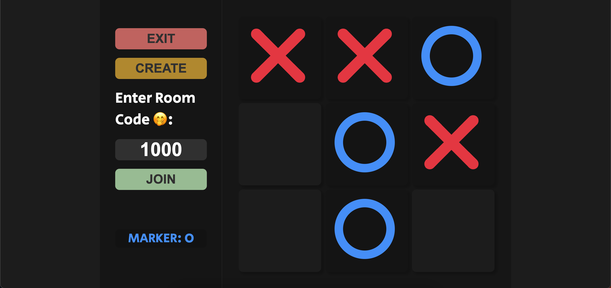

  <h3 align="center">Games, TicTacToe</h3>
  Play TicTacToe with your friends online!
  

    <a href="https://github.com/shubhamistic/shubhamistic.github.io/tree/main/games/tictactoe"><strong>Explore the docs »</strong></a>
     
    ·
    <a href="https://github.com/shubhamistic/shubhamistic.github.io/issues">Report Bug</a>
    ·
    <a href="https://github.com/shubhamistic/shubhamistic.github.io/issues">Request Feature</a>
    ·
  

## Visit
[shubhamistic.github.io/games/tictactoe](https://shubhamistic.github.io/games/tictactoe)

## Demo

## About

Introducing the ultimate multiplayer Tic Tac Toe experience!
Immerse yourself in the stunning visuals of our beautifully
designed webpage, made possible with the power of Flask and 
Socket.IO. Play with friends and challenge them to a game of 
strategy and wits. It's time to show off your Tic Tac Toe 
skills and dominate the competition!

## Tech Stack
- HTML
- CSS
- JavaScript
- jQuery

## Author
[@shubhamistic](https://www.github.com/shubhamistic)

## Feedback
If you have any feedback, please reach out to me at my email address [shubham2003garg@gmail.com](mailto:shubham2003garg@gmail.com)

(<a href="#readme-top">back to top</a>)
